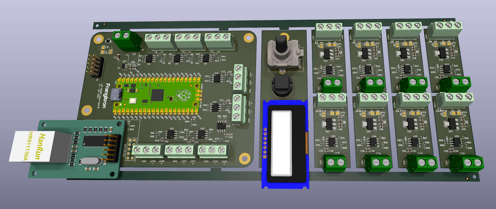
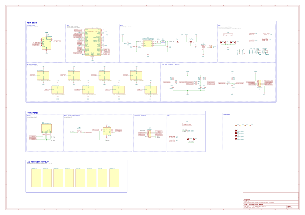
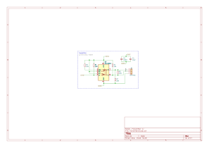
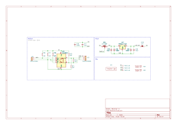

# LED Board - PCB

v1 January 2024

## Main board

ArtNet to LED strips (x8 RS485 transmitters)

- Raspberry Pi Pico

- ENC28J60 SPI module

- Front panel for screen, rotary encoder, push button

## Receiver  (x8)

RS485 to LED strip

## Schematics

