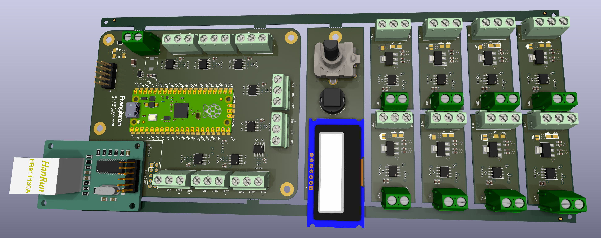

# LED Board - PCB

v1 January 2024

This project works with
- [LED Board - Firmware minimal](https://github.com/MrFrangipane/ledboard-firmware-minimal)
- [LED Board - Desktop minimal](https://github.com/MrFrangipane/ledboard-desktop-minimal)
- [LED Board - Firmware full](https://github.com/MrFrangipane/ledboard-firmware-full)
- [LED Board - Desktop full](https://github.com/MrFrangipane/ledboard-desktop-full)

## Main board

ArtNet to LED strips (x8 RS485 transmitters)

- Raspberry Pi Pico

- ENC28J60 SPI module

- Front panel for screen, rotary encoder, push button

## Receiver  (x8)

RS485 to LED strip

## Schematics

## Gerbers

- Edge Cuts

- F Cu

- In1 Cu

- In2 Cu

- B Cu

- F Silkscreen

- B Silkscreen

- F Paste

- B Paste

- F Mask

- B Mask

